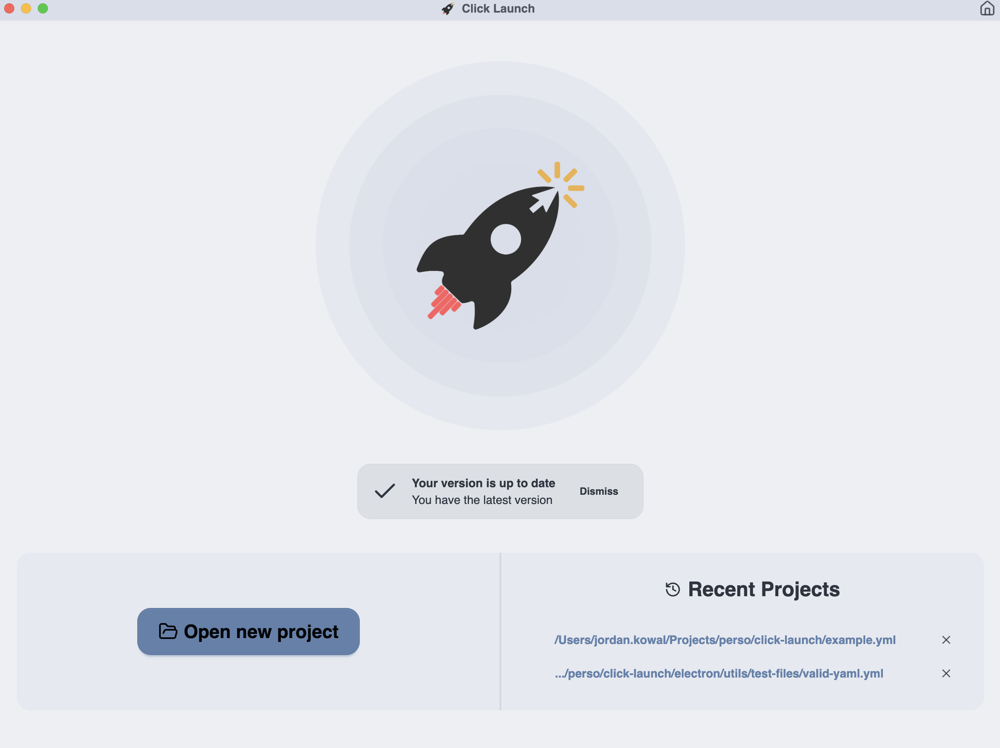
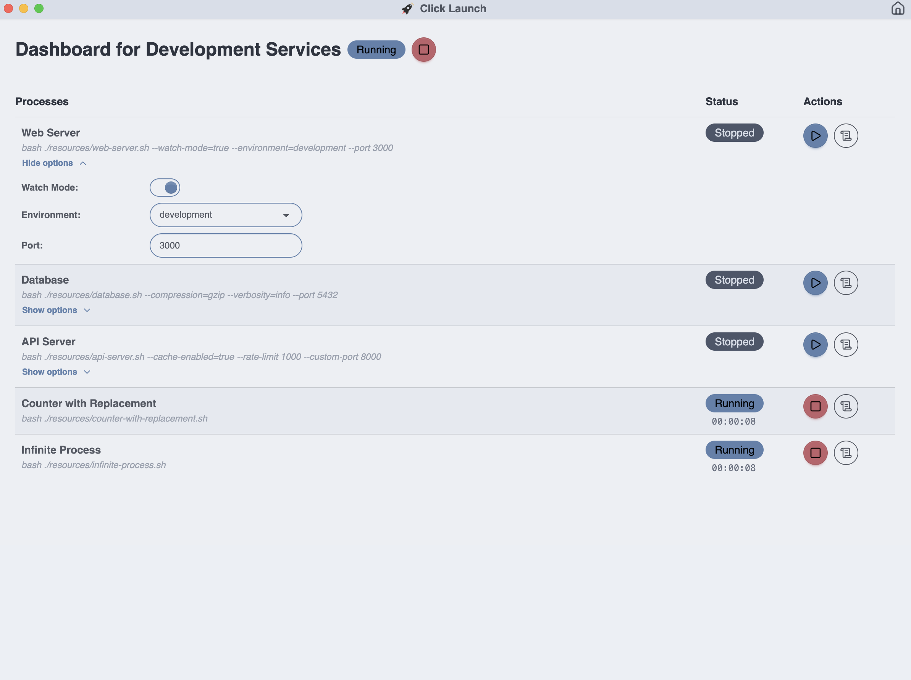
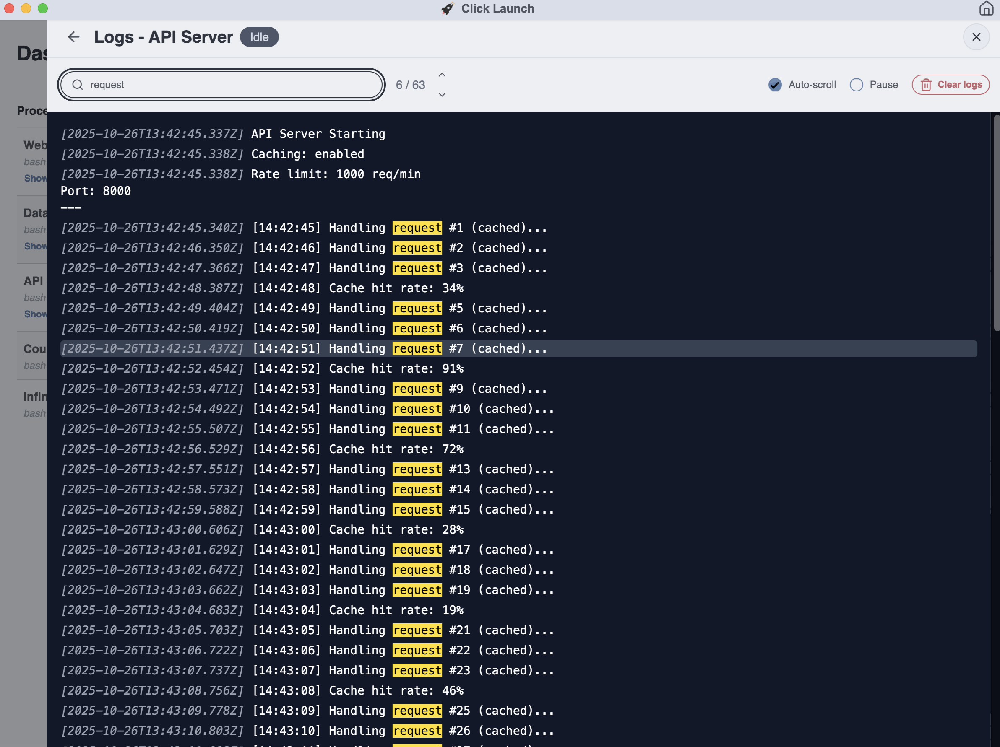

# ✨ Click Launch ✨

<div align="middle">
  <div>
    
  </div>
  <strong>Desktop app for managing your local dev stack - configure once, launch everything with a click.</strong>
  <br />
  <br />
  <div>
  
  
  
  
  
  </div>
  <br />
  <br />
</div>

- [✨ Click Launch ✨](#-click-launch-)
  - [📖 Overview](#-overview)
  - [✨ Features](#-features)
  - [📦 Installation](#-installation)
    - [Download](#download)
    - [First Run](#first-run)
  - [⚙️ Configuration](#️-configuration)
    - [Root Configuration](#root-configuration)
    - [Process Configuration](#process-configuration)
    - [Environment Variables Configuration](#environment-variables-configuration)
    - [Restart Configuration](#restart-configuration)
    - [Argument Configuration (All Types)](#argument-configuration-all-types)
    - [Toggle-Specific Configuration](#toggle-specific-configuration)
    - [Select-Specific Configuration](#select-specific-configuration)
    - [Input-Specific Configuration](#input-specific-configuration)
    - [Example Configuration](#example-configuration)
  - [🚀 Usage](#-usage)
  - [⌨️ Keyboard Shortcuts](#️-keyboard-shortcuts)
  - [🤝 Contributing](#-contributing)
  - [📄 License](#-license)
  - [💬 Support](#-support)

## 📖 Overview

**Click Launch** is a desktop application that streamlines your local development workflow. Instead of manually starting multiple services (databases, web servers, APIs, etc.) with different commands and arguments, you configure them once in a YAML file and launch everything with a single click.

**Latest release - [ClickLaunch-1.5.0.zip](https://github.com/Jordan-Kowal/click-launch/releases/download/1.5.0/ClickLaunch-1.5.0.zip)**

## ✨ Features

- **Click to launch**: Start your entire dev stack instantly
- **Visual interface**: GUI for starting, stopping, and monitoring processes
- **Flexible configuration**: YAML-based setup with customizable arguments
- **Process monitoring**: Real-time status, logs, and runtime tracking
- **Argument types**: Toggle switches, dropdowns, and text inputs
- **Environment variables**: Set custom env vars per process, merged with system environment
- **Auto-restart**: Automatically restart crashed processes with configurable retry limits
- **Process grouping**: Organize processes into collapsible groups with per-group start/stop
- **Resource monitoring**: Real-time CPU and memory usage per process
- **Log export**: Export process logs as plain text files for sharing or debugging

| Homepage                              | Dashboard                               | Log Drawer                                |
| ------------------------------------- | --------------------------------------- | ----------------------------------------- |
|  |  |  |

## 📦 Installation

### Download

**Option 1: One-line installer (Recommended)**. It will download the latest release and install it to your Applications folder.

```bash
curl -fsSL https://raw.githubusercontent.com/Jordan-Kowal/click-launch/main/setup.sh | bash
```

**Option 2: Manual installation**

1. Go to the [Releases page](https://github.com/Jordan-Kowal/click-launch/releases)
2. Download the latest `ClickLaunch-x.x.x.zip` file
3. Double-click the ZIP file to extract it
4. Run: `xattr -cr ClickLaunch.app` to remove quarantine attributes (because I'm not registered on the Apple Store)
5. Drag the ClickLaunch.app to your Applications folder
6. Launch the app from Applications or Spotlight

### First Run

On macOS, you may see a security warning when first opening the app. To resolve this:

1. Go to **System Preferences** → **Security & Privacy**
2. Click **"Open Anyway"** next to the ClickLaunch warning
3. Alternatively, right-click the app and select **"Open"** from the context menu

## ⚙️ Configuration

Create a `config.yml` file in your project directory to define your development stack. The configuration follows this structure:

### Root Configuration

| YAML Path      | Type     | Required | Description                          | Example                     |
| -------------- | -------- | -------- | ------------------------------------ | --------------------------- |
| `project_name` | `string` | ✅       | Display name for your project        | `"My Dev Stack"`            |
| `processes`    | `array`  | ✅       | List of processes to manage (min: 1) | See process structure below |

### Process Configuration

| YAML Path                  | Type     | Required | Description                                                             | Example                  |
| -------------------------- | -------- | -------- | ----------------------------------------------------------------------- | ------------------------ |
| `processes[].name`         | `string` | ✅       | Display name for the process                                            | `"Web Server"`           |
| `processes[].base_command` | `string` | ✅       | Base command to execute                                                 | `"npm start"`            |
| `processes[].group`        | `string` | ❌       | Group name for organizing processes                                     | `"Backend"`              |
| `processes[].cwd`          | `string` | ❌       | Working directory for the process (relative to config file or absolute) | `"./packages/api"`       |
| `processes[].env`          | `object` | ❌       | Custom environment variables                                            | See env config below     |
| `processes[].restart`      | `object` | ❌       | Auto-restart configuration                                              | See restart config below |
| `processes[].args`         | `array`  | ❌       | List of configurable arguments                                          | See argument types below |

### Environment Variables Configuration

Define custom environment variables for each process. These are merged with the system environment, with your custom values taking precedence.

```yaml
processes:
  - name: "API Server"
    base_command: "pnpm start"
    env:
      NODE_ENV: development
      DEBUG: "api:*"
      DATABASE_URL: "postgres://localhost:5432/mydb"
```

**Rules:**

- `env` field is optional
- If present, must be an object with string keys and string values
- Empty string values are allowed (useful for declaring a variable exists)
- Values override any existing system environment variables with the same name

### Process Grouping Configuration

Add an optional `group` field to organize processes into collapsible groups. Processes sharing the same group are displayed together with Start All / Stop All controls. Ungrouped processes appear in an "Other" section.

```yaml
processes:
  - name: "PostgreSQL"
    group: "Infrastructure"
    base_command: "docker compose up postgres"
```

### Restart Configuration

Configure automatic restart behavior for processes that crash unexpectedly.

| YAML Path                | Type      | Required | Default | Description                                          |
| ------------------------ | --------- | -------- | ------- | ---------------------------------------------------- |
| `restart.enabled`        | `boolean` | ✅       | -       | Enable/disable auto-restart                          |
| `restart.max_retries`    | `number`  | ❌       | `3`     | Max consecutive restart attempts before giving up    |
| `restart.delay_ms`       | `number`  | ❌       | `1000`  | Delay in milliseconds before restarting              |
| `restart.reset_after_ms` | `number`  | ❌       | `30000` | Reset retry counter if process runs longer than this |

**Behavior:**

- Processes that exit with code `0` (clean exit) are not restarted
- Manually stopped processes are not restarted
- The retry counter resets if the process runs successfully for longer than `reset_after_ms`
- When max retries are exceeded, the process shows a "Crashed" status

### Argument Configuration (All Types)

| YAML Path        | Type     | Required | Description                                   | Example                           |
| ---------------- | -------- | -------- | --------------------------------------------- | --------------------------------- |
| `args[].type`    | `string` | ✅       | Argument type: `toggle`, `select`, or `input` | `"toggle"`                        |
| `args[].name`    | `string` | ✅       | Display name in UI                            | `"Watch Mode"`                    |
| `args[].default` | `any`    | ✅       | Default value (type depends on arg type)      | `true`, `"development"`, `"3000"` |

### Toggle-Specific Configuration

| YAML Path                | Type      | Required | Description                                       | Example            |
| ------------------------ | --------- | -------- | ------------------------------------------------- | ------------------ |
| `args[].values`          | `array`   | ✅       | Exactly 2 values: one for `true`, one for `false` | See toggle example |
| `args[].values[].value`  | `boolean` | ✅       | Must be `true` or `false`                         | `true`             |
| `args[].values[].output` | `string`  | ❌       | Command line output (can be empty)                | `"--watch"`        |

### Select-Specific Configuration

| YAML Path                | Type     | Required | Description                        | Example               |
| ------------------------ | -------- | -------- | ---------------------------------- | --------------------- |
| `args[].values`          | `array`  | ✅       | List of options (min: 2)           | See select example    |
| `args[].values[].value`  | `string` | ✅       | Option value                       | `"development"`       |
| `args[].values[].output` | `string` | ❌       | Command line output (can be empty) | `"--env=development"` |

### Input-Specific Configuration

| YAML Path              | Type     | Required | Description                | Example    |
| ---------------------- | -------- | -------- | -------------------------- | ---------- |
| `args[].output_prefix` | `string` | ❌       | Prefix added to user input | `"--port"` |

### Example Configuration

```yaml
project_name: "Development Services"

processes:
  - name: "Web Server"
    group: "Frontend"
    base_command: "pnpm start"
    restart:
      enabled: true
      max_retries: 3
      delay_ms: 1000
      reset_after_ms: 30000
    args:
      - type: "toggle"
        name: "Arg1"
        values:
          - value: true
            output: "--arg1"
          - value: false
            output: ""
        default: true

      - type: "select"
        name: "Environment"
        values:
          - value: "development"
            output: "--env=development"
          - value: "staging"
            output: "--env=staging"
          - value: "production"
            output: "--env=production"
        default: "development"

      - type: "input"
        name: "Port"
        default: "3000"
        output_prefix: "--port"

      - type: "input"
        name: "Additional args"
        default: ""
        output_prefix: ""
```

**Notes**:

- For input arguments, set `output_prefix: ""` if you want the raw value without any prefix.
- The `restart` configuration is optional. Processes without it will show "Crashed" status on non-zero exit.

## 🚀 Usage

1. **Open Click Launch**
2. **Load your config**: File → Open config file
3. **Configure arguments**: Adjust toggles, dropdowns, and inputs as needed
4. **Launch processes**: Click the play button next to each service
5. **Monitor**: View real-time logs and runtime information
6. **Stop when done**: Use stop buttons or close the app

## ⌨️ Keyboard Shortcuts

Press `⌘ + /` while the log drawer is open to display the keyboard shortcuts reference.

| Shortcut | Description |
|----------|-------------|
| `⌘ + /` | Show keyboard shortcuts |
| `⌘ + F` | Focus search input |
| `Escape` | Close shortcuts modal or drawer |
| `Enter` | Next search result |
| `Shift + Enter` | Previous search result |

## 🤝 Contributing

1. Fork the repository
2. Create a feature branch
3. Make your changes
4. Run tests and quality checks
5. Submit a pull request

See [CONTRIBUTING.md](CONTRIBUTING.md) for detailed guidelines.

## 📄 License

This project is licensed under the MIT License - see the [LICENSE](LICENSE) file for details.

## 💬 Support

- **Issues**: [GitHub Issues](https://github.com/Jordan-Kowal/click-launch/issues)
- **Discussions**: [GitHub Discussions](https://github.com/Jordan-Kowal/click-launch/discussions)
